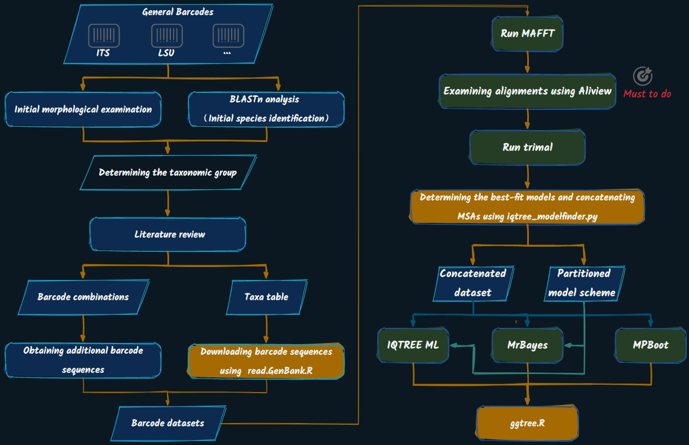

# 

## Overview

BPA is a bioinformatics pipeline designed for [briefly describe your purpose]. It supports a range of scripts for processing and analyzing genomic data.



## Installation

### Prerequisites

- Python 3.6 or later
- R 4.0 or later
- [List any other dependencies]

### Using `pip`:

You can install BPA by cloning this repository and using `pip`:

```bash
git clone https://github.com/yourusername/BPA.git
cd BPA
pip install .
