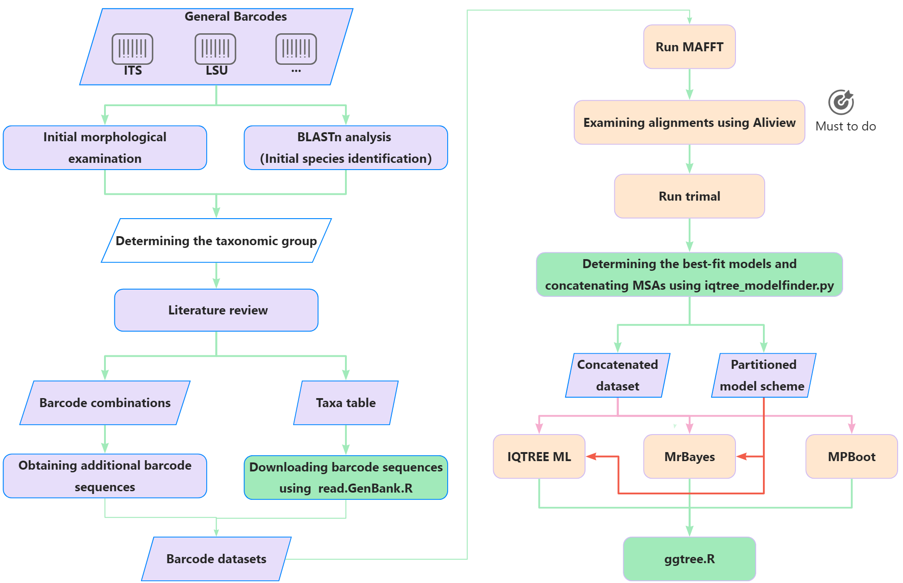

# 

## Overview

BPA is a bioinformatics pipeline designed for barcode sequence-based phylogenetic analysis. It supports a range of scripts for processing and analyzing batcode data.



## Installation

### Prerequisites

- Python 3.6 or later
- R 4.0 or later
- [List any other dependencies]

### Using `pip`:

You can install BPA by cloning this repository and using `pip`:

```bash
git clone https://github.com/yourusername/BPA.git
cd BPA
pip install .
```

## Usage

```# define function to check whether the folder exists
is_exist_folder() {
    folder_name=$1
    if [[ ! -d ${folder_name} ]]; then
        mkdir ${folder_name}
        echo "${folder_name} folder created"
    else
        echo "${folder_name} folder already exists"
    fi
}
```

# step1: download barcode sequences using the script read.GenBank.R, which require that the taxa table must be prepared follow it's rules.
```
cat 01_data/00_sanger_raw_data/2021032807_ITS.fasta >> 01_data/Boeremia_ITS.fasta
cat 01_data/00_sanger_raw_data/2021032807_LROR_LR5.fasta | sed 's/_LROR_LR5//' >> 01_data/Boeremia_LSU.fasta
cat 01_data/00_sanger_raw_data/2021032807_PNS1_NS41.fasta | sed 's/_PNS1_NS41//' >> 01_data/Boeremia_SSU.fasta
cat 01_data/00_sanger_raw_data/2021032807_RPB2.fas | sed 's/_RPB2//' >> 01_data/Boeremia_RPB2.fasta
cat 01_data/00_sanger_raw_data/2021032807_TUB2.fas | sed 's/_TUB2//' >> 01_data/Boeremia_TUB2.fasta
```

# step2: multiple sequence alignments using mafft
```
is_exist_folder 02_mafft
ls 01_data/ | grep fasta | while read a;do echo "mafft --localpair --thread 4 --adjustdirection 01_data/${a} > 02_mafft/${a%.fasta}.mafft.fna";done > mafft.sh
bash mafft.sh
sed -i 's/>_R_/>/' 02_mafft/*.mafft.fna
```

# step3: trim the msa using trimal
```
is_exist_folder 03_trimal
ls 01_data/ | grep fasta | sed 's/.fasta//' |while read a;do trimal -in 02_mafft/${a}.mafft.fna -gt 0.5 -out 03_trimal/${a%.mafft.fna}.mafft.trimal.fna;done
```

# step4: find the evolutionary models and concatenate the msa together by the identical identifiers
```
is_exist_folder 04_modelfinder
outgroup_label=Phoma_herbarum_CBS_615.75
mafft_items=$(ls 03_trimal/*)
iqtree_modelfinder.py -i ${mafft_items} -o 04_modelfinder --mrbayes_nexus --outgroup ${outgroup_label}
```

# step5: maximum likelihood phylogenetic analysis using iqtree
```
is_exist_folder 05_iqtree
nohup iqtree2 -s 04_modelfinder/concatenated.fna --seqtype DNA -o ${outgroup_label} --prefix 05_iqtree/iqtree_ml -T AUTO -p 04_modelfinder/best_scheme.txt --ufboot 1000 --alrt 1000 &
```

# step6: Bayesian analysis using Mrbayes
```
is_exist_folder 06_mrbayes
nohup mpirun -n 4 mb < run_mrbayes.sh # if mpirun does not work, please : nohup bash mb < run_mrbayes &
nohup mpirun -n 4 mb < run_mrbayes.sh # if mpirun does not work, please : nohup bash mb < run_mrbayes &```
```
